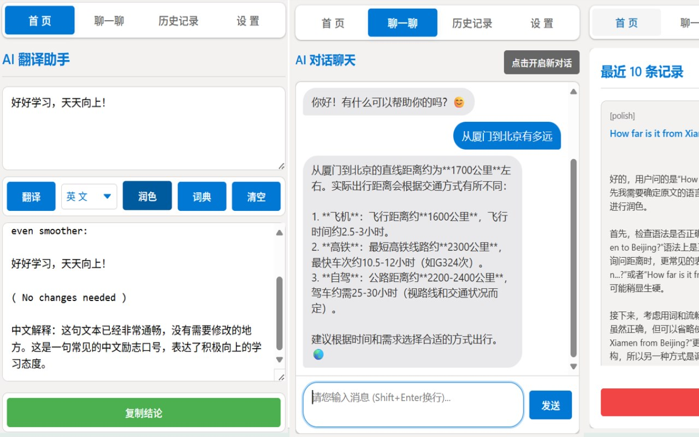

# AI-based Translator

[](https://microsoftedge.microsoft.com/addons/detail/aibased-translator/mbjmkkdimfkjbjjfkjafdibnphdaoaej)
[](https://opensource.org/licenses/MIT)
[](CONTRIBUTING.md)

> AI-powered translation and assistant browser extension — Chinese, English, Japanese, Korean. Free. Works out of the box.



## ✨ Features

- **AI Translation** — Translate between Chinese, English, Japanese, and Korean. Auto-detects source language with natural, accurate results.
- **Text Polishing** — Intelligent language detection. Polishes writing while preserving meaning, with detailed revision notes in Chinese.
- **AI Dictionary** — Core definitions, parts of speech, root/affix analysis, and bilingual example sentences.
- **AI Chat** — Sidebar-style AI chat assistant with conversation memory.
- **History** — Auto-saves the last 10 translation and query records.

## 🚀 Installation

### From Microsoft Edge Add-ons Store

<a href="https://microsoftedge.microsoft.com/addons/detail/aibased-translator/mbjmkkdimfkjbjjfkjafdibnphdaoaej">
  
</a>

1. Click the badge above to open the Edge Add-ons store page.
2. Click **Get** to install.
3. The extension is ready to use immediately with the built-in free API channel.

### Sideload (Developer Mode)

1. Clone this repository:
   ```bash
   git clone https://github.com/OpenTester007/Chat-with-KB.git
   ```
2. Open `edge://extensions/` in Microsoft Edge.
3. Enable **Developer mode** (toggle in the bottom-left).
4. Click **Load unpacked** and select the cloned folder.
5. The extension should now appear in your toolbar.

## ⚙️ Configuration

| Setting | Default | Description |
|---------|---------|-------------|
| **API Key** | *(pre-configured)* | Your NVIDIA Build API key. [Get a free key →](https://build.nvidia.com) |
| **API Endpoint** | `https://integrate.api.nvidia.com/v1` | Customize for OpenAI-compatible providers. |
| **Model** | `openai/gpt-oss-20b` | Choose from presets or enter any model ID. |
| **Streaming** | *On* | Toggle between real-time streaming and batch responses. |

### Supported Models (Presets)

| Model | Type |
|-------|------|
| `openai/gpt-oss-20b` | Reasoning (default) |
| `deepseek-ai/deepseek-v4-flash` | Chat (MoE, 284B) |
| `meta/llama-3.3-70b-instruct` | Chat |
| `google/gemma-4-31b-it` | Chat |

You can also enter any custom OpenAI-compatible model ID.

### Using Local Ollama

To use a local Ollama instance, set the environment variable and configure the endpoint:

```bash
# Set environment variable before starting Ollama
set OLLAMA_ORIGINS=*
ollama serve
```

Then in the extension settings, set:
- **API Endpoint**: `http://localhost:11434/v1`
- **Model**: your Ollama model name (e.g., `llama3`, `qwen2.5`, `mistral`)

## 🛠 Tech Stack

- **Manifest V3** — Chrome Extension Manifest V3 specification
- **Vanilla JavaScript** — No frameworks, lightweight and fast
- **NVIDIA Build API** — Default AI backend (OpenAI-compatible)
- **CSS Custom Properties** — Themed UI with dark mode support

## 🔧 Development

```bash
git clone https://github.com/OpenTester007/Chat-with-KB.git
cd Chat-with-KB
# Load unpacked in edge://extensions/ (Developer mode)
```

Edit `popup.js`, `popup.html`, or `style.css`, then reload the extension from `edge://extensions/`.

## 📁 Project Structure

```
├── manifest.json          # Extension manifest (MV3)
├── popup.html             # Main popup UI
├── popup.js               # Application logic
├── style.css              # Styles
├── screenshots/           # Screenshots for documentation
├── 16.png / 32.png        # Extension icons
├── 48.png / 128.png       # Extension icons (larger)
├── LICENSE                # MIT License
├── CONTRIBUTING.md        # Contribution guidelines
├── CODE_OF_CONDUCT.md     # Community code of conduct
├── ROADMAP.md             # Planned features
└── CHANGELOG.md           # Release history
```

## 🤝 Contributing

Contributions are welcome! See [CONTRIBUTING.md](CONTRIBUTING.md) for guidelines.

## 📜 License

MIT © [AI-based Translator Contributors](LICENSE)

## 🙏 Acknowledgements

- Powered by [NVIDIA Build](https://build.nvidia.com) free AI platform
- Built on the [OpenAI-compatible API](https://platform.openai.com/docs/api-reference) standard

---

Made with ❤️ by [OpenTester007](https://github.com/OpenTester007)
