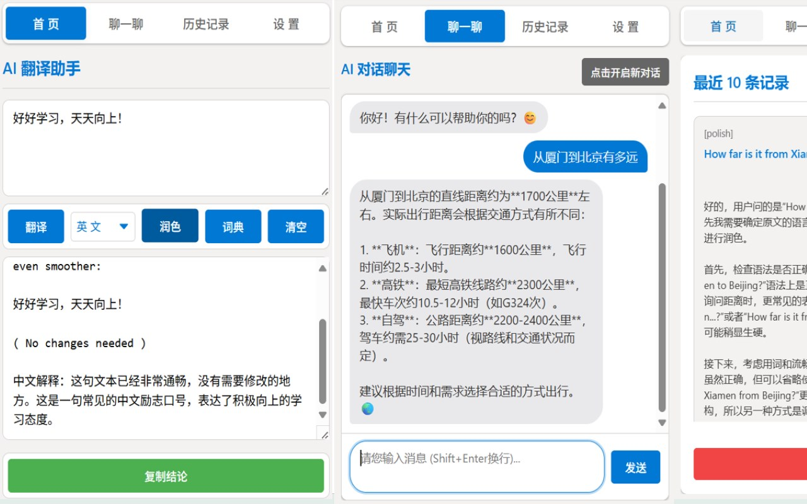

# AI-based Translator

[](https://microsoftedge.microsoft.com/addons/detail/aibased-translator/mbjmkkdimfkjbjjfkjafdibnphdaoaej)
[](https://opensource.org/licenses/MIT)
[](CONTRIBUTING.md)

> Translation and assistant browser extension for Chinese, English, Japanese, and Korean.



> [!TIP]
> **Frictionless Setup (No API Key Required to Test!)**
> If you want to test the extension immediately without registering an API key, simply go to the **Settings** (设置) tab and click the **"导入测试密钥"** (Import Test Key) link. This will automatically import a pre-configured, free, and fully functional API Key, Endpoint, and Model preset, allowing you to start translating and chatting instantly.

## Features

- **Background Execution**: Translation, polishing, dictionary, and chat requests run in a background service worker. Switching tabs or closing the popup will not interrupt active operations, and finished results are automatically saved to your history.
- **One-Click Demo Setup**: Instantly populate working API configurations from settings via a secure cloud-fetch or local obfuscated fallback.
- **Translation**: Translate between Chinese, English, Japanese, and Korean. Auto-detects source language.
- **Text Polishing**: Polish text and explain changes in Chinese.
- **Dictionary**: Definitions, parts of speech, root/affix analysis, and bilingual example sentences.
- **Chat**: Sidebar chat assistant with conversation memory.
- **History**: Saves the last 10 translation records locally.

## Installation

### From Microsoft Edge Add-ons Store

<a href="https://microsoftedge.microsoft.com/addons/detail/aibased-translator/mbjmkkdimfkjbjjfkjafdibnphdaoaej">
  
</a>

1. Click the badge above to open the Edge Add-ons store page.
2. Click **Get** to install.

### Sideload (Developer Mode)

1. Clone this repository:
   ```bash
   git clone https://github.com/OpenTester007/Chat-with-KB.git
   ```
2. Open `edge://extensions/` in Microsoft Edge.
3. Enable **Developer mode**.
4. Click **Load unpacked** and select the cloned folder.
5. Open the extension Settings tab, click **"导入测试密钥"** (Import Test Key) to auto-configure, or enter your own custom API Key.

## Configuration

| Setting | Default | Description |
|---------|---------|-------------|
| **API Key** | empty | Add your own NVIDIA Build or OpenAI-compatible provider key. |
| **API Endpoint** | `https://integrate.api.nvidia.com/v1` | Customize for OpenAI-compatible providers. Remote endpoints must use HTTPS. |
| **Model** | `openai/gpt-oss-20b` | Choose from presets or enter any model ID. |
| **Streaming** | On | Toggle between real-time streaming and batch responses. |

### Supported Models (Presets)

| Model | Type |
|-------|------|
| `openai/gpt-oss-20b` | Reasoning (default) |
| `deepseek-ai/deepseek-v4-flash` | Chat |
| `meta/llama-3.3-70b-instruct` | Chat |
| `google/gemma-4-31b-it` | Chat |

You can also enter any custom OpenAI-compatible model ID.

### Using Local Ollama

To use a local Ollama instance, set the environment variable and configure the endpoint:

```bash
set OLLAMA_ORIGINS=*
ollama serve
```

Then in the extension settings, set:
- **API Endpoint**: `http://localhost:11434/v1`
- **Model**: your Ollama model name, such as `llama3`, `qwen2.5`, or `mistral`
- **API Key**: leave empty for local endpoints that do not require a key

Remote non-local HTTP endpoints are intentionally blocked; use HTTPS for hosted providers.

## Tech Stack

- **Manifest V3**
- **Vanilla JavaScript**
- **OpenAI-compatible Chat Completions API**

## Development

```bash
git clone https://github.com/OpenTester007/Chat-with-KB.git
cd Chat-with-KB
# Load unpacked in edge://extensions/ (Developer mode)
```

Edit `popup.js`, `popup.html`, `background.js`, or `style.css`, then reload the extension from `edge://extensions/`.

Basic checks:

```bash
node --check popup.js
node --check background.js
```

## Project Structure

```text
manifest.json          # Extension manifest (MV3)
background.js          # Service worker and API request handling
popup.html             # Main popup UI
popup.js               # Popup UI logic
style.css              # Styles
screenshots/           # Screenshots for documentation
16.png / 32.png        # Extension icons
48.png / 128.png       # Extension icons
LICENSE                # MIT License
CONTRIBUTING.md        # Contribution guidelines
CODE_OF_CONDUCT.md     # Community code of conduct
ROADMAP.md             # Planned features
CHANGELOG.md           # Release history
```

## Architecture & Security Design

This project is built under strict compliance with modern **Manifest V3** extension standards, focusing heavily on safety, efficiency, and compliance:

* **Strict Content Security Policy (CSP)**: Completely complies with Chrome/Edge Web Store requirements. Zero usage of unsafe-eval or inline styles. All styles and logic reside in static `.css` and `.js` files.
* **XSS Prevention**: User and AI outputs are rendered strictly using safe DOM APIs (e.g. `textContent` and `innerText`) to completely mitigate cross-site scripting (XSS) risks.
* **Non-Blocking Background Worker**: Network requests and LLM streams run in `background.js` (Service Worker) using runtime message ports. The extension popup UI can be closed or switched to other tabs while tasks execute seamlessly in the background.
* **Encrypted Key Transmission**: Test API-Key credentials are split-encoded in local Base64 buffers and fetched remotely using HTTPS JSON endpoints, preventing repository scanners from flagging credentials while maintaining dynamic test availability.

## OpenAI Codex for OSS Program

This repository is submitted to the **OpenAI Codex/API for Open Source Software** program. 

Our mission is to build a completely free, fast, and privacy-first browser translation assistant. By gaining access to OpenAI's advanced reasoning models, we plan to implement:
1. **Context-Aware Paragraph Translation**: Understanding document context beyond single sentences for industry-grade precision.
2. **Autonomous Coding Explanations**: Deep explanation of code snippets inside the dictionary cards.
3. **Advanced local history search** leveraging semantic search embeddings.

*All contributions and documentation comply with open-source MIT guidelines.*

## Privacy

Settings, chat history, and translation history are stored locally with the browser storage API. Text entered by the user is sent to the configured API provider for processing.

## License

MIT, see [LICENSE](LICENSE).
